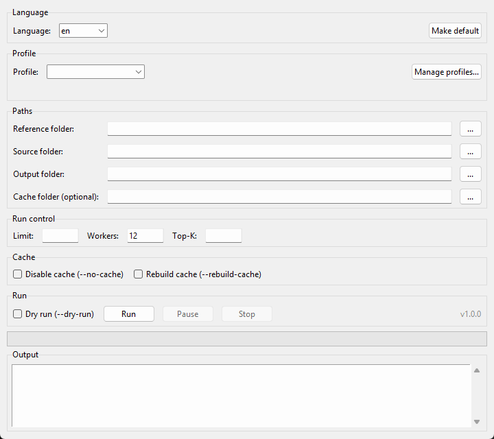

# High-Accuracy Image Matcher

[](https://github.com/csakwolfie/image-matcher/actions/workflows/tests.yml)
[](LICENSE)
[](https://www.python.org/)

🇬🇧 English | 🇭🇺 [Magyar](README.hu.md)



A classical (non-neural) OpenCV feature-matching image search tool: given a set of
**reference** (cropped) images, it finds the corresponding **original, full** image in
a large source folder. It uses SIFT / AKAZE / ORB / BRISK detectors and RANSAC
homography, with a two-stage (fast pre-filter + precise verification) strategy so it
stays practical even on large (multi-thousand image) source sets.

**No neural network, no GPU, no `torch`.** Just classical computer vision
(keypoint detection + RANSAC geometric verification) — deterministic, fully
explainable matches (every result comes with concrete `good_matches`/
`inliers`/`score` numbers), and a `pip install` that's done in seconds on a
CPU-only machine.

> Version: **1.0.0**. Full development history in [DEVLOG.md](DEVLOG.md) (Hungarian
> only — see note below). Free and open source under the MIT license
> ([LICENSE](LICENSE)) — use, modify, and redistribute freely, including for
> commercial purposes.

> **Note on language**: this README is bilingual, and as of the `--lang` switch (see
> [Language](#language)) the CLI/console output and GUI are too — pass `--lang en` (or
> set it as the default) for English output. Code comments and the development log
> (`DEVLOG.md`) remain **Hungarian-only**.

---

## Contents

- [How it works](#how-it-works)
- [Installation](#installation)
- [Quick start](#quick-start)
- [GUI](#gui)
- [Directory structure](#directory-structure)
- [Architecture / modules](#architecture--modules)
- [CLI parameters](#cli-parameters)
- [Configuration: config.yaml and profiles](#configuration-configyaml-and-profiles)
- [Outputs](#outputs)
- [Cache system](#cache-system)
- [Testing](#testing)
- [Troubleshooting](#troubleshooting)
- [License](#license)

---

## How it works

**Two-stage search:**

1. **Preprocessing** — every image (reference + source) is downscaled to a medium
   size (`cache_long_side`, 1600px by default), converted to grayscale, and cached as
   an 8-bit JPEG. Incremental: only new images get processed on subsequent runs.
2. **Stage 1 (fast candidate search)** — on the small cached images, using **only**
   the first (highest-priority, SIFT by default) detector, it scores **every** source
   (no exclusionary absolute threshold, just a technical minimum), and carries the
   best `top_k` (8 by default) candidates forward.
3. **Stage 2 (precise decision)** — the candidates are reloaded from the **original,
   full-resolution** files, and evaluated with all 4 detectors (in priority order,
   with early-accept) against strict thresholds.
4. **On a match**, the source file is copied into the `found/` folder under the
   reference's filename (keeping the source's own extension).

**Why two stages?** Comparing a large source set against every reference with every
detector at full resolution would be unmanageably slow. The fast stage 1 (small
images, 1 detector) narrows the candidates down to a short list, which the expensive,
precise stage 2 then runs on.

**Why is there no exclusionary threshold in stage 1?** An earlier version had a higher
technical minimum there, which excluded genuine matches from the candidate list before
they ever got a chance at the precise stage 2 — this was one of the biggest sources of
error in the project's history. Stage 1 therefore only **ranks**, never excludes based
on an absolute threshold; the actual decision is always made by stage 2.

**Homography plausibility check** — protection against "magnet images" (source images
with a periodic/repetitive pattern, e.g. grid lines, perforations) that can
accidentally receive a geometrically "clean-looking" but content-wise incorrect RANSAC
fit. For a genuine photo-crop/source pair, the affine part of the estimated homography
(rotation + scale + mild shear) falls within a sane range; a degenerate fit (mirroring,
extreme shear, unrealistic scaling) is a strong sign of a false geometric match — this
filter rejects those.

**Console output** — every reference gets a short block:

```
[021/363] img-020.jpg  ✓ FOUND
  → _MES1234.jpg  (det=SIFT)
  good=287 | inliers=241 | score=0.934

[022/363] img-021.jpg  ~ NEAR MISS
  → _MES5678.jpg
  good=182 | inliers=96 | score=0.641
  reason: inlier_ratio 0.436 < MIN_INLIER_RATIO 0.93
```

`✓ EXISTS` (already in `found/`), `✓ FOUND` (match), `~ NEAR MISS` (a
geometrically plausible candidate existed, it just fell short of the
threshold — `REJECT_INLIER_RATIO`/`REJECT_SCORE`), `✗ NOT FOUND` (every
other rejection reason). A continuously updating status bar at the bottom
shows the overall picture:

```
Progress: 19/363 (5.2%) | 00:14 elapsed | ETA 04:44 | FOUND 12 | NOT FOUND 7
```

(The status bar only appears in a real terminal — it automatically disables
itself when output is redirected/piped. The log file always receives the
block messages; never the status bar.)

---

## Installation

Python 3.10+ (developed on 3.14). Two options:

**1. Installed as a package** (recommended — this also gives you a real
`image-matcher` command alongside `python run.py`):

```bash
git clone <repo-URL>
cd image-search
pip install -e .
```

**2. Just the dependencies, running from source:**

```bash
pip install -r requirements.txt
```

> AKAZE and BRISK detectors require a full `opencv-contrib-python` build — this is
> already the project's default dependency (not the narrower `opencv-python`). If they
> are still missing on your system, the tool reports it with a warning and continues
> with whichever detectors are available (see [Troubleshooting](#troubleshooting)).

> **Minimal/headless Linux servers** (e.g. Docker base images, machines without a
> desktop environment): `opencv-contrib-python` may fail to import with a `libGL.so.1`
> error, since it links against a graphics library that isn't installed on such
> systems. Either install the system library (Debian/Ubuntu: `sudo apt install
> libgl1`) or swap the dependency for `opencv-contrib-python-headless`, which doesn't
> need it — only relevant if you're not also running the GUI on that machine.

---

## Quick start

```bash
python run.py --reference "D:\reference-images" --source "E:\source-images" --output "runs\2026-08-11"
```

(If installed as a package, the same works as
`image-matcher --reference ... --source ... --output ...`, without `python run.py`.)

Validation only, no search (a quick sanity check before starting a run that might take
hours):

```bash
python run.py -r "D:\reference-images" -s "E:\source-images" -o "runs\test" --dry-run
```

With a different profile and a limited number of references (for quick testing):

```bash
python run.py -r ref_dir -s src_dir -o out --profile high_recall --limit 20
```

List available profiles:

```bash
python run.py --list-profiles
```

---

## GUI

The CLI flags (language, profile, paths, `--limit`/`--workers`/`--top-k`,
`--no-cache`/`--rebuild-cache`/`--dry-run`) are also available through a
Tkinter GUI — no extra dependency needed (Tkinter ships with the Python
standard library). Launch it with:

```bash
python run_gui.py
# or
python -m image_matcher.gui
# if installed as a package:
image-matcher-gui
```

Besides Run, there are Pause/Resume and Stop buttons — they take effect
before the NEXT reference starts (a single reference's own two-stage
search can't be interrupted mid-flight, only between references). On
pause/cancel, whatever partial results were gathered so far are still
saved to `results.csv`/`results_candidates.csv`. The "Make default" button
next to the language dropdown does the same thing as passing `--lang
<code>` on its own from the CLI (see [Language](#language)).

> On some Linux distributions Tkinter isn't installed alongside Python by
> default — install the OS package first (e.g. Debian/Ubuntu:
> `sudo apt install python3-tk`; Fedora: `sudo dnf install python3-tkinter`).
> Not needed if you only use the CLI (`image-matcher`).

---

## Directory structure

```
image-search/
  run.py                    ← entry point (for running from source, CLI)
  run_gui.py                 ← entry point for the Tkinter GUI
  pyproject.toml            ← package metadata, dependencies, "image-matcher"/"image-matcher-gui" commands
  LICENSE                    ← MIT license
  image_matcher/              ← the program's source code (see below)
    gui/                        ← Tkinter GUI (app.py, worker.py, argv_builder.py)
    data/
      config.yaml               ← factory defaults (tunable constants)
      profiles/
        balanced.yaml             ← strict thresholds (default choice)
        high_recall.yaml           ← looser thresholds, better recall
        diagnostic.yaml             ← very loose, never early-accepts (for tuning)
      lang/
        hu.lang.json                ← every user-facing string in the program, in Hungarian
        en.lang.json                 ← the same, in English
  tests/                      ← unittest smoke/integration tests
```

`config.yaml`/`profiles/` are the factory defaults bundled with the package — you
shouldn't need to edit them directly. To create your own override, place a
`config.yaml` and/or `profiles/` directory in your **run's working directory** (takes
priority), or in `~/.image_matcher/` (a user-level override, independent of the
working directory). See [Configuration](#configuration-configyaml-and-profiles).

The `lang/` directory holds all of the program's console/error/help text as
key→string JSON files (`<lang-code>.lang.json`), discovered with the same
precedence as `config.yaml`/`profiles/`. The [`--lang` switch](#language)
picks which one is active (default: `hu`); adding a new language just means
dropping a new `<code>.lang.json` file here (or in the
`~/.image_matcher/lang/`/working-directory override) — no code changes
needed.

After a run, the **output directory** (`--output DIR`) contains:

```
<output>/
  found/                     ← the matched, renamed source files
  results.csv                ← per-reference summary
  results_candidates.csv     ← detailed candidate×detector log
  log_20260811_225412.txt    ← full console output, timestamped
  cache/                     ← image + descriptor cache (unless --no-cache)
```

---

## Architecture / modules

| Module | Responsibility |
|---|---|
| `image_matcher/config.py` | Loading `config.yaml` + `profiles/*.yaml`, precedence resolution (`Config` — immutable dataclass) |
| `image_matcher/image_io.py` | Unicode-safe image loading on Windows, scaling, CLAHE |
| `image_matcher/detectors.py` | Detector factory (SIFT/AKAZE/ORB/BRISK/KAZE) + per-thread (thread-local) detector instances |
| `image_matcher/cache_disk.py` | `DescriptorCache` — in-memory and optionally persistent on-disk feature descriptors, with fingerprint-based invalidation |
| `image_matcher/preprocessing.py` | Incremental build of the small, 8-bit JPEG cache (for stage 1) |
| `image_matcher/matching.py` | Descriptor matching, RANSAC geometric verification, homography plausibility, score computation, DecisionReason categorization |
| `image_matcher/search.py` | Stage 1 (`stage1_rank_candidates`) and stage 2 (`find_best_match_for_reference`) |
| `image_matcher/reporting.py` | Writing `results.csv` and `results_candidates.csv` |
| `image_matcher/cli.py` | Command-line interface (grouped `argparse`) |
| `image_matcher/main.py` | Orchestration — wiring the whole pipeline together |

Every function receives an explicit `Config` instance as a parameter (no mutable
global state) — a run's settings are guaranteed to stay consistent from start to
finish.

---

## CLI parameters

```
python run.py [options...]
```

### Language

| Option | Description |
|---|---|
| `--lang LANG` | The program's language — currently `hu` and `en`. `--help` text is also shown in the chosen language (the language is resolved before the help parser is even built). An unknown language makes the program exit with an error listing the available ones. Adding a new language only needs a new `<code>.lang.json` file under `data/lang/` (see [Configuration](#configuration-configyaml-and-profiles)) — no code changes. |

**Setting the default language:** passing `--lang LANG` **on its own**
(with no other flag) doesn't attempt a search — instead it permanently
saves the given language to `config.yaml`'s `default_language` key, and
every `--lang`-less run from then on uses it:

```
python run.py --lang en
# 'en' is now the default language, saved to: ...\.image_matcher\config.yaml
```

If you don't have your own `config.yaml` override yet (neither in your
working directory nor in `~/.image_matcher/`), this creates one at
`~/.image_matcher/config.yaml` — a FULL copy of the factory defaults with
just `default_language` overridden (from then on, tuning settings load
from this file, not automatically from package updates — see
[Configuration](#configuration-configyaml-and-profiles)). If you already
have an override (working-directory or user-level), it's updated in
place, keeping your other settings. A `--lang` alongside `--reference`/
`--source`/`--output`/`--list-profiles`/`--dry-run` only applies to that
run — it does NOT change the persistent default.

### Profile management

| Option | Description |
|---|---|
| `--profile NAME` | Load a named profile from `profiles/` (e.g. `--profile diagnostic`). If omitted, only `config.yaml`'s defaults apply. |

### Paths

| Option | Description |
|---|---|
| `--reference DIR`, `-r` | Directory of reference (cropped) images. **Required.** |
| `--source DIR`, `-s` | Directory of original, full images to search within. **Required.** |
| `--output DIR`, `-o` | Output directory (see [Directory structure](#directory-structure)). **Required.** |

### Run control

| Option | Description |
|---|---|
| `--limit N` | Only process the first N references (alphabetically) — for quick testing. |
| `--workers N`, `-w` | Number of parallel threads. Defaults to CPU core count. Recommended: physical core count — more threads just cause unnecessary heat/throttling. |
| `--top-k N` | How many candidates go from stage 1 to stage 2. Default: the `config.yaml`/profile `stage1_top_k` value (8). Recommended: 6–10. |

### Cache

| Option | Description |
|---|---|
| `--cache DIR` | Location of the cache directory. Defaults to `<output>/cache`. |
| `--no-cache` | Disables caching entirely (neither image nor descriptor cache) — everything is recomputed on every run. Slower, but no cache directory remains on disk afterward. |
| `--rebuild-cache` | Ignores and overwrites existing cache contents (forced regeneration), then continues writing cache as normal. |

### Execution

| Option | Description |
|---|---|
| `--dry-run` | Validates paths and the resolved (CLI+profile+config.yaml) settings, counts the images to be processed — but doesn't run an actual search, and doesn't write `found/`, CSVs, or cache. |
| `--version` | Prints the program version and exits. |
| `--list-profiles` | Lists the profiles available in `profiles/` (with their one-line descriptions) and exits. |

### Precedence

**Explicit CLI flag > `--profile` file > `config.yaml` default.**

In other words: if a value lives in `config.yaml`, the selected profile can override
it, and an explicit CLI flag (where one exists — currently only `--top-k`) overrides
both.

---

## Configuration: config.yaml and profiles

The tunable constants (thresholds, detector parameters, CLAHE, homography check,
cache size, top-k, etc.) live in
**[image_matcher/data/config.yaml](image_matcher/data/config.yaml)**, with
comments/descriptions — this is the factory default, always loaded unless overridden.
These values were tuned from **real near-miss data (failure analysis)**, not guessed —
before changing them, it's worth looking at `results_candidates.csv`.

### Where config.yaml and profiles/ are looked up

Precedence (first match wins):

1. `./config.yaml` / `./profiles/` in the **current working directory** — if you place
   your own `config.yaml`/`profiles/` directory here, it's used instead of the bundled
   factory defaults.
2. `~/.image_matcher/config.yaml` / `~/.image_matcher/profiles/` — a user-level
   override, always active regardless of working directory.
3. The factory defaults bundled with the package (`image_matcher/data/`) — this always
   exists, the final safety net, and works even for an installed package.

### Key settings

| Key | Default | Meaning |
|---|---|---|
| `min_good_matches` | 200 | Minimum "good" matches before geometric verification (RANSAC) |
| `min_inliers` | 220 | Minimum RANSAC inliers for final acceptance |
| `min_inlier_ratio` | 0.93 | Minimum inlier / good-match ratio |
| `score_uncertain` | 0.97 | The actual acceptance score threshold |
| `score_accept` | 0.75 | Above this, don't try a lower-priority detector |
| `early_accept_score` | 1.00 | Above this (on a successful match), skip trying the remaining detectors |
| `ratio_test_sift` / `ratio_test_bin` | 0.60 / 0.65 | Lowe ratio test threshold (float vs. binary descriptors) |
| `cache_long_side` | 1600 | Longer side of the stage-1 (fast) cache images, in pixels |
| `stage1_top_k` | 8 | How many candidates go from stage 1 to stage 2 |
| `stage1_min_good_matches` | 8 | **Technical minimum only** in stage 1 — NOT an exclusionary threshold |
| `use_clahe` | true | Adaptive contrast equalization before feature detection |
| `use_homography_check` | true | "Magnet image" protection (see above) |
| `detector_priority` | `[SIFT, AKAZE, ORB, BRISK]` | Stage-2 detector order |
| `max_process_size` / `min_process_size` | 2200 / 400 | Size limits for precise (stage-2) processing |
| `default_language` | `hu` | The default language when `--lang` isn't passed — **not a feature-matching tunable**, it's a CLI/i18n setting (see [Language](#language)); profiles can't override it |

The full list, with all comments, is in
[image_matcher/data/config.yaml](image_matcher/data/config.yaml).

### Profiles

Each file under `profiles/` is one profile — the filename (without extension) is the
profile's name. A profile file only lists the keys it **overrides** relative to
`config.yaml` (no need to duplicate everything), plus an optional `description:` field
used in the `--list-profiles` output.

| Profile | When to use it |
|---|---|
| `balanced` | **The default choice.** Strict thresholds — measured at 0 false matches (100% precision) on a real test set. Matches `config.yaml`'s factory values. |
| `high_recall` | When the goal is minimizing missed (false negative) matches, and a higher false-match risk is acceptable. **Not formally benchmarked against precision** — worth validating against `results_candidates.csv` on your own dataset before production use. |
| `diagnostic` | **Not for production use.** Very loose thresholds + early-accept disabled (every available detector always runs against every candidate) — gives the most detailed possible `results_candidates.csv` log for threshold tuning. |

To create your own profile: create a `profiles/my_profile.yaml` file in your working
directory (or in `~/.image_matcher/profiles/`), listing only the keys you want to
override, then use `--profile my_profile`.

---

## Outputs

### `results.csv` — per-reference summary

| Column | Meaning |
|---|---|
| `Reference` | The reference file's name |
| `MatchedFile` / `SavedAs` | The matched source file's name / the name it was saved as in `found/` (`NOT_FOUND` / `SKIPPED_ALREADY_IN_FOUND` if there's no match / it already existed) |
| `GoodMatches` / `Inliers` / `Score` | The winning candidate's metrics |
| `NearMissFile` / `NearMissGood` / `NearMissInliers` / `NearMissScore` | On NOT_FOUND: the best (but below-threshold) candidate — for diagnostics |
| `Stage1Diag` | Diagnostic text, if stage 1 already found no candidates |
| `Stage1Candidates` | How many candidates advanced from stage 1 |
| `WinningDetector` | Which detector found the match (SIFT/AKAZE/ORB/BRISK) |
| `DecisionReason` | Compact, machine-filterable category — see below |
| `RejectReason` | Detailed, textual failure reason |

### `results_candidates.csv` — detailed candidate×detector log

**Every** (candidate, detector) combination actually tried in stage 2 gets its own
row: `Stage1Rank`, `Stage1Score`, `GoodMatches`, `Inliers`, `InlierRatio`,
`Stage2Score`, `Success`, `IsWinner`, `DecisionReason`, `RejectReason`. This is the
primary tool for threshold tuning — it shows exactly which candidate failed at which
specific gate (good_matches / inliers / inlier_ratio / score / homography
plausibility).

### `DecisionReason` categories

| Category | Meaning |
|---|---|
| `ACCEPT_STRONG_GEOMETRY` | Accepted, with a high inlier ratio (above `decision_strong_ratio`) |
| `ACCEPT_INLIER` | Accepted, but with a more modest inlier ratio |
| `REJECT_NO_INLIERS` | Not enough good matches / RANSAC found no homography |
| `REJECT_SCALE` | Homography plausibility rejection: unrealistic scaling |
| `REJECT_HOMOGRAPHY` | Homography plausibility rejection: mirroring / extreme shear |
| `REJECT_INLIER_RATIO` | Inlier count or ratio below threshold |
| `REJECT_SCORE` | Combined score below threshold |

---

## Cache system

There are two independent cache layers:

1. **Image cache** (`<cache>/reference/<size>/` and `<cache>/source/<size>/`) — the
   downscaled, grayscale, 8-bit JPEG images for stage 1. Incremental: existing files
   aren't regenerated.
2. **Descriptor cache** (`<cache>/descriptors/`) — computed feature descriptors saved
   to disk, so **repeated runs** (e.g. while tuning thresholds) don't need to redo the
   expensive feature detection.

The descriptor cache key includes a hash ("fingerprint") of the processing settings
(CLAHE, detector parameters, processing size) — if any of these change (e.g. due to a
profile switch), the cache is automatically invalidated and will **not** silently
return stale results.

- `--rebuild-cache` — force-regenerates both layers, then continues writing cache as
  normal.
- `--no-cache` — neither layer is used persistently; the image cache is built in a
  temporary directory (required by the two-stage algorithm's structure), which the
  program deletes at the end of the run.

---

## Testing

The project includes `unittest`-based smoke and integration tests (`tests/`),
runnable without pytest:

```bash
python -m unittest discover -s tests -t .
```

Coverage includes: profile precedence, homography plausibility (rejecting
mirroring/extreme shear/unrealistic scaling), CLAHE contrast effect, descriptor cache
disk hit/miss and fingerprint invalidation, incremental image cache building, config
discovery precedence, and an **end-to-end test**: a synthetic, textured image crop
correctly finds its original source among several candidates under the `balanced`
profile's strict thresholds, and correctly returns NOT_FOUND when only "unrelated"
candidates are present.

---

## Troubleshooting

**`[FIGYELMEZTETÉS] AKAZE/BRISK nem elérhető ebben az OpenCV buildben`** ("AKAZE/BRISK
not available in this OpenCV build") — the installed OpenCV build doesn't include
these algorithms (can happen even alongside `opencv-contrib-python`, depending on the
specific build). The tool reports this with a warning and continues with whichever
detectors are available — this isn't an error, just an environment-dependent
limitation.

**Accented/special-character directory names on Windows** — `image_io.py` uses
Unicode-safe loading (`np.fromfile` + `cv2.imdecode`, with a Pillow fallback), so this
requires no special configuration.

**A reference comes back `NEM TALÁLHATÓ` ("NOT FOUND") when you think it shouldn't**
— check `results_candidates.csv`: for every candidate actually tried, you'll find the
exact failure reason (`RejectReason` / `DecisionReason`). If many candidates fail near
`REJECT_INLIER_RATIO` or `REJECT_SCORE`, it may be worth trying the `high_recall`
profile, or gathering a more detailed log with the `diagnostic` profile.

**Slow runs on very large source sets** — increase `--workers` up to your physical CPU
core count (beyond that it won't help), and/or lower `--top-k` (fewer candidates go
into the expensive stage 2).

---

## License

MIT — see the [LICENSE](LICENSE) file. Free to use, modify, and redistribute,
including for commercial purposes.
